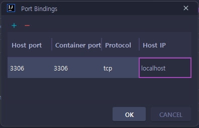

# jwp_cat_picture_search

## 주의사항
- 이 저장소는 [해당 강의](https://school.programmers.co.kr/learn/courses/16643/16643-javaspring%EA%B3%A0%EC%96%91%EC%9D%B4-%EC%82%AC%EC%A7%84-%EA%B2%80%EC%83%89-%EC%82%AC%EC%9D%B4%ED%8A%B8-api-%EA%B3%BC%EC%A0%9C-%ED%92%80%EC%96%B4%EB%B3%B4%EA%B8%B0)의 미션 저장소 입니다.

## 주제(시나리오)
고양이를 좋아하는 당신은 고양이 사진 전용 검색 웹사이트를 구현해보려고 합니다. 고양이 사진이 나와야 하기 때문에 데이터를 가져와야 하는데 좋은 오픈 API가 존재합니다. 그 API를 이용해 데이터를 DB에 저장하고 서비스를 만들어 봅시다.

## 과제 설명
- [thecatapi](https://thecatapi.com/)에서 일부분의 데이터를 가져옵니다.
- 매번 API를 쏘는건 비효율적이니 간단하게 데이터를 DB에 저장해봅니다.
- DB를 세팅하기 위해 Docker를 이용해서 DB세팅을 해봅니다.
- 그 데이터를 가지고 필요한 API를 만들어 봅니다.

## API

### 1\. GET /cats/random50

#### Request parameter

None

#### Query paramter

None

#### Response

Success 200

| Field name | Type | Description |
| --- | --- | --- |
| data | Array | 랜덤한 50개의 고양이 사진 목록입니다. |

``` typescript
HTTP/1.1 200 OK
{
  "data": [{
    id: string
    url: string
    name: string
  }]
}
```

### 2\. GET /cats/search

#### Request parameter

None

#### Query paramter

| Field name | Type | Description |
| --- | --- | --- |
| q | string | 고양이의 품종(영어/한글) |

#### Response

Success 200

| Field name | Type | Description |
| --- | --- | --- |
| data | Array | Keyword로 검색된 고양이 사진 목록입니다. |

``` typescript
HTTP/1.1 200 OK
{
  "data": [{
    id: string
    url: string
    name: string
  }]
}
```

### 3\. GET /cats/:id

#### Request parameter

| Field name | Type | Description |
| --- | --- | --- |
| id | string | 고양이 사진의 id값 입니다. |

#### Query paramter

None

#### Response

Success 200

| Field name | Type | Description |
| --- | --- | --- |
| data | Object | Id로 검색된 고양이 사진 입니다. |

``` typescript
HTTP/1.1 200 OK
{
  "data": {
    name: string
    id: string
    url: string
    width: number
    height: number
    temperament: string
    origin: string
  }
}
```

## 초기설정

### 1. Dokerfile을 오른쪽 마우스 버튼을 클릭하면 Run Configuration을 수정할 수 있습니다. Container name을 설정하고 Run 파트의 Modyfy를 눌러서 Run options를 설정하고 ```--env-file db_info.env``` 를 넣어줍니다.


### 2. Run 파트의 Modify를 눌러서 Bind ports를 누르고 아래와 같이 설정해줍니다.



### 3. Dockerfile의 실행 버튼을 눌러서 실행해줍니다.


### 4. Dockerfile와 같은 레벨에 db_info.env 파일을 생성하고 아래의 값을 넣어줍니다.

```
MYSQL_DATABASE=cat_db
MYSQL_ROOT_PASSWORD=cat1234!#
```

### 5. src와 같은 레벨에 env 디렉토리를 만들고 그 내부에 cat_api_info.env 파일을 생성하고 아래 값을 넣어줍니다.


```aidl
CAT_API_HOST=https://api.thecatapi.com/v1
CAT_API_KEY=자신의 API key 넣기
```

### 6. 애플리케이션을 실행해줍니다.
